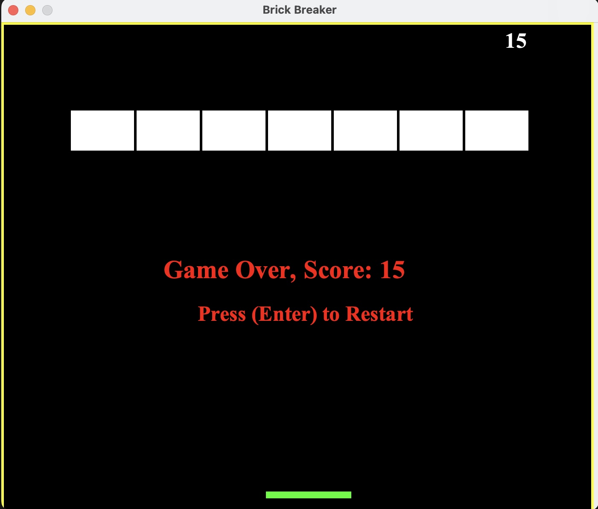

## Repository Link:
https://github.com/moavern/brickbreaker-game

## Description
I started this program after I had finished my Snake game. BrickBreaker was a game I played quite a bit when I was younger so I figured it would be a fun to program my own version of the game. The game was easier to program and helped me learn how to restart the program from within the GUI, which was something I couldn't figure out when I created the Snake game.

For this program, I also used three different classes. I used three different classes for this program. Gameplay.java is where the majority of the code is at. This class makes the ball and the bricks as well as all the physics involved with them. MapGenerator.java is basic, it just makes the GUI to display the game. Finally Main.java does essentially what I had it do in the Snake program, it just starts the game.

Overall, this program helped cement the basic concepts of Java to me.

